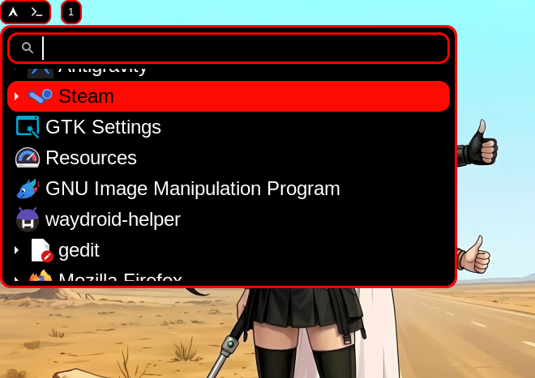
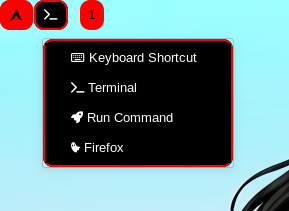
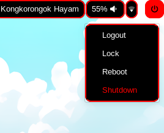
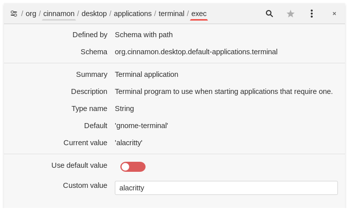

# Niri Tifa

Konfigurasi niri sederhana bertema warna dan wallpaper Tifa.

## Screenshot

### Desktop
Tifa dan Aerith nyari tumpangan. Tentu saja cuma wallpaper yang bisa diganti.

### Menu 1 - Aplikasi Launcher
Menggunakan wofi

### Menu 2 - Umum
Karena kenyataannya windows manager gak ada standar shortcut umum, custom semua, jadi bisa saja lupa shortcutnya, apalagi kalau baru pertama kali coba pakai WM, atau sekian waktu gak buka Komputer, makanya dibuat menu ini, memang sih niri ada show up shortcut pas awal di buka, tapi saat itu ke tutup belum ke hapal semua kadang bingung mau pencet apa buat nampilin itu lagi, ya namanya belum ke hapal/ kebaca semua, dan saya kena istilah `SKILL ISSUE` di banyak hal. Jadi intinya biar bagian topbar bisa beroperasi hanya dengan klik mirip DE.
 

### Menu 3 - System Poweroff/Shutdown
untuk Shutdown, Restart, dll.
 

### Jam Sunda
Cuma gimik nama istilah jam dalam bahasa Sunda untuk tiap jamnya, yang di Sundanya sendiri mulai jarang digunakan. Beda daerah Sunda bisa beda varian referensi.
 
Link [JamSunda](https://github.com/tawakaltakwa/JamSunda), btw yang jam_sunda2.sh (versi referensi 2) ada sedikit error script tampilan yang tak kunjung saya dibenerin sampai sekarang. Jadi gunakan yang jam_sunda.sh saja atau benerin sendiri.
 

## Shortcut
Untuk launch aplikasi dipisah pake ALT. kebanyakan control umum masih default niri.

| Keyboard | Fungsi |
| --- | --- |
| ALT+SPACE | Open app launcher: wofi |
| ALT+B | Open browser |
| ALT+L | Lock screen: gtklock |
| ALT+R | Command runner: wmenu |
| ALT+E | File manager: nemo |
| ALT+T | Terminal: alacritty |
| MOD+Return (Enter) | Terminal: alacritty (juga)|
| ALT+Escape | Task Manager: Resources |
| MOD+F | Maximize window |
| MOD+SHIFT+F | Fullscreen |
| MOD+SHIFT+1 | Screenshot Selection |
| MOD+SHIFT+2 | Screenshot Fullscreen |
| MOD+SHIFT+3 | Screenshot Window |
| MOD+Q | Tutup window |
| MOD+BACKSPACE | Tutup window (juga) |

nemu duplikat shortcut? Emang duplikat, pernah nyoba macam-macam WM, pernah membiasakan diri ngikutin shortcut default tutup window pake MOD+Q dan pernah juga membiasakan diri dengan MOD+Backspace, jadi yang biar kondisional refrek jarinya ke yang mana tetap operasional. Lagipula gak bikin eror system, jadi boleh kan...

Folder hasil screenshot di ~/Pictures/Screenshots

## Instalasi / Konfigurasi

Cuma backup konfigurasi pribadi, gak ada script auto installer, jadi kalau mau pakai ya copy paste saja isi folder niri-tifa ke ~/.config/

## Aplikasi yang digunakan

- niri
- waybar
- gtklock
- wofi
- mako
- fastfetch
- wmenu
- alacritty
- nemo
- nemo-fileroller
- nm-applet / network-manager-applet
- xwayland-satellite
- polkit-gnome
- capitaine-cursors
- resources
- celestial-gtk-theme (yang warna merah)
- flat-remix (ikon)
- nwg-look (untuk milih tema gtk, ikon, cursor, dll)

## Catatan

open terminal nemo defaultnya gnome-terminal, untuk gantinya bisa di setting pake deconf-editor.
 
